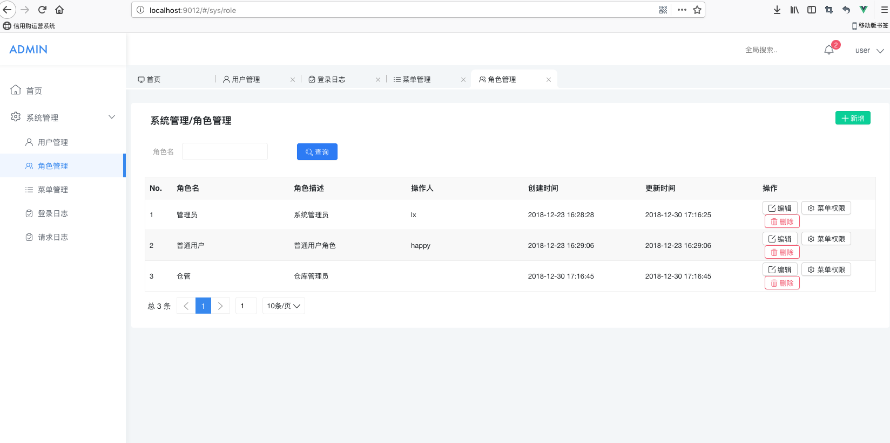
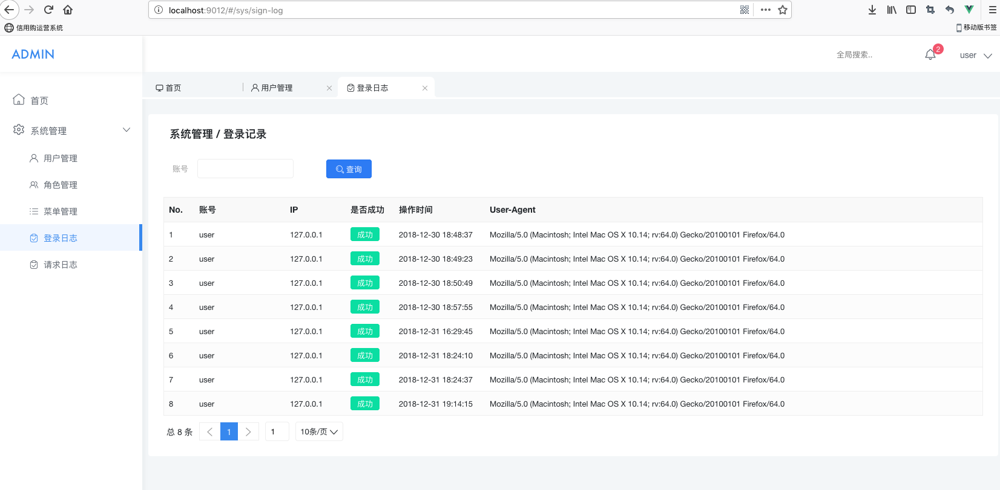

##后端配置
1.运行前请点击右上角运行旁边的下拉  
2.选择编辑 editor configuration  
3.在build里  
4.选择添加 Maven Goal  
5.方框里输入clean compile -Dmaven.test.skip=true -Pdev  
运行dev环境  
（PS:dev代表resource里env里dev里的配置）


##前端heyui

环境安装
```$shell
npm install heyui
```
脚手架安装  
```
sudo npm install -g hey-cli --unsafe-perm=true --allow-root  
```
运行  
```$xslt
hey dev
```
*参考*   

https://github.com/heyui/heyui-admin

##图片参考  
 
 
 
 
 
 
 

